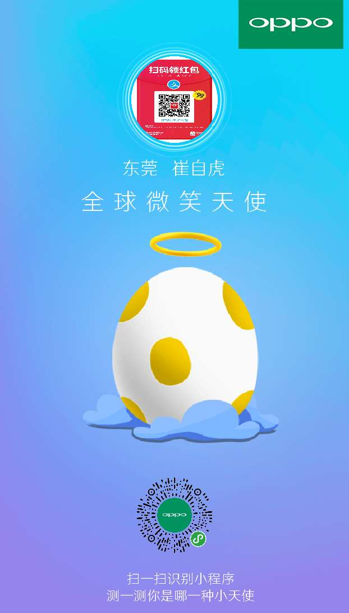

是一个 小程序生成带小程序码的库的图片  的库

在需要生成的页面中引入这个库 

然后创建一个 js

注意：生成图片带头像的时候。一定要记得把头像放自己服务器。

如果直接请求微信的地址 会卡个1-2分钟的（在真机上面）

首先我们看一眼生成的图片

流程

1.首页请求向后台请求code地址

	getMinAppCode()

2.然后开始把网络图片下载到本地

	draw()

	对于downloadImgList感兴趣的同学自己去看看

	这个的作用是把一个图片链接是数组传过去，返回了的是对应的本地图片的路径

	app.downloadImgList(httpList).then(res => {
		//搞一个数组(就是对应的要画的图片的本地路径)
	  let arr = ['/common/images/BG4.png', res[0], '/common/images/logo.png', '/common/images/1.png', res[1], '/common/images/head-icon.png']
	  this.canvas_draw(arr)
	})

3.canvas_draw 创建画所需要的data

	let params = {
  canvasId: 'combinCanvas', //页面上canvas的canvas-id
  width: 622,//canvas的宽
  height: 1090,//canvas的高
  data: [{
      name: 'bg',
      type: 'image', //类型是图片
      source: path[0],
      x: 0,
      y: 0,
      width: 622,
      height: 1090
    },
    {
      name: 'head',
      type: 'image', //类型是图片 头像一般设计是圆形
      status: 1, //是否为圆  会自动裁剪
      source: path[1],
      x: (622 - 154) / 2,
      y: 100,
      width: 154,
      height: 154
    },
    {
      name: 'name',
      type: 'text',// 是文字
      textColor: '#ffffff',//文字颜色
      text: `${_this.data.userInfo.RegionName}  ${_this.data.userInfo.Name}`,
      font: 32,//文字大小
      x: 310,
      y: 300,
    }
  ]
 

4.用我们引入的库 开始作画 具体想要知道的流程。可以自己去研究一下

	 idraw.draw(params, function(res) {
		//这个res 就是生成的图片的本地路径
		//我们把他保存下来
		//然后去保存本地
		_this.setData({
		shareImgSrc: res
		})
		_this.saveImgFile(res)
	});

5. saveImgFile 保存本地

	因为这个是本地临时资源。。如果直接保存，那么在模拟器是ok的。。但是真机就会报错
	所以。我们需要把这个本地临时资源发送到服务器，服务器临时保存，把地址返回过来。然后我们再下载下来
	然后调用wx.saveImageToPhotosAlbum 去保存图片
	至于这块权限的问题。后续再讲。 或者你看看我的hero内的文件吧
	     var $this = this;
		    let SessionKey = wx.getStorageSync('SessionKey')
		    wx.uploadFile({
		      url: app.domainName + '/handler/UploadFile.ashx?method=SynthesisImage&SessionKey=' + SessionKey,
		      filePath: imgSrc,
		      name: "file",
		      success(res) {
		        let data = JSON.parse(res.data);
		        wx.downloadFile({
		          url: app.domainName + data.result,
		          success: function(res) {
		            wx.hideLoading()
		            wx.saveImageToPhotosAlbum({
		              filePath: res.tempFilePath,
		              success: function(data) {
		                wx.showToast({
		                  title: "已保存"
		                })
		              },
		              fail: function(err) {
		                if (err.errMsg == "saveImageToPhotosAlbum:fail auth deny") {
		                  app.toast('你未开启图片授权')
		                  $this.setData({
		                    openSetting: "openSetting"
		                  });
		                }
		              }
		            });
		          }
		        });
		      }
		    })